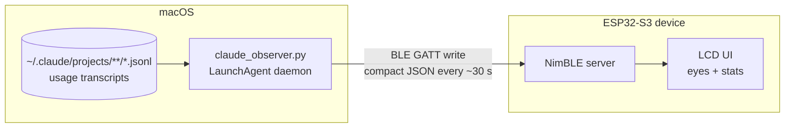
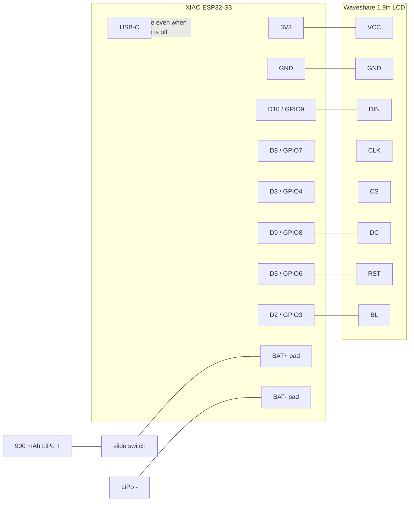

# Claude Observer

|||
|:--:|:--:|
|Connected|Disconnected|

A tiny desk companion that shows your Claude Code usage. A macOS daemon mines
Claude Code's local transcripts and pushes stats over BLE to an ESP32-S3 with a
1.9" LCD — a pair of Claude-orange eyes that blink when connected and sleep
when your Mac is away.

```
ClaudeObserver/
├── daemon/      macOS LaunchAgent (Python) — collects stats, BLE central
└── firmware/    Seeed XIAO ESP32-S3 (PlatformIO) — BLE peripheral + display
```

## How it works



Data sources, in order of preference:

1. **Official spend & limit** — the exact monthly `used / limit` in dollars from
   the same (undocumented) billing endpoint claude.ai uses. The daemon
   (`fetch_official_budget`) tries two auth methods in order:
   - **OAuth token** from `~/.claude/.credentials.json`
     (`https://api.anthropic.com/api/oauth/usage`). Zero setup for most Claude
     Code users; if the token is merely expired, run any `claude` command to
     refresh it.
   - **Browser session key** as a fallback
     (`https://claude.ai/api/organizations/<org_id>/usage`). On enterprise/SSO
     logins the OAuth token is often stale and never refreshes, so set
     `session_key` + `org_id` in `secrets.json` — or let the daemon read them
     from `~/.claude/claude_usage_config.json`. This path needs `curl_cffi`
     (in `requirements.txt`) to get past Cloudflare.

   The result is cached for `official_budget_ttl_seconds` (config, default 300 s)
   so it isn't refetched every cycle.
2. **Local transcripts** — every assistant turn in
   `~/.claude/projects/**/*.jsonl` carries the model id and exact token usage.
   Used for everything the endpoint doesn't provide (per-day spend, model
   split, tokens, sessions, last month) with costs from the pricing table in
   `daemon/config.json`, and as the monthly fallback when the endpoint is
   unreachable (then `monthly_budget_usd` from config is the limit). The daemon
   reads these **incrementally** — a `UsageCollector` keeps per-day running
   totals in memory and each cycle parses only the newly-appended bytes of files
   whose size/mtime changed, rather than re-reading every transcript.

### Data shown on the display

| Stat                         | Source                                                                          |
| ---------------------------- | ------------------------------------------------------------------------------- |
| Monthly budget spent / total | official usage endpoint (fallback: summed JSONL cost / `monthly_budget_usd`)    |
| Daily budget spent / total   | today's cost / (monthly budget ÷ days in month)                                 |
| Top 3 models today           | today's cost share per model family                                             |
| Last month spent             | summed cost of previous calendar month                                          |
| Tokens today + month         | all tokens incl. cache read/write                                               |
| ESP temp + BLE signal        | device internal temperature and connection RSSI, top-right corner               |
| `data stale...`              | shown top-left when no BLE update has arrived for 5 min                          |

> The BLE payload also carries `ses` (sessions today) and `mm` (month model
> split), but the current firmware doesn't render them — see [BLE protocol](#ble-protocol).

## 1. macOS daemon

```bash
cd daemon
./install.sh        # venv + deps + LaunchAgent, starts at login and now
```

- Configure budget, pricing, and `update_interval_seconds` in
  `daemon/config.json`; personal overrides (fallback `monthly_budget_usd`, and
  the `session_key` / `org_id` for the official-budget fallback) go in
  `daemon/secrets.json` (gitignored, created from `secrets.example.json`).
- Debug without BLE: `python3 claude_observer.py --once` prints the payload.
- Logs: `/tmp/claudeobserver.log`. Uninstall: `./uninstall.sh`.
- macOS will prompt once for **Bluetooth permission** for Python — allow it
  (System Settings → Privacy & Security → Bluetooth if you missed the prompt).

Why a LaunchAgent: it is the native lightweight way to run a per-user
background process — auto-starts at login (`RunAtLoad`), auto-restarts on crash
(`KeepAlive`), no Dock icon, no Electron. The daemon itself is a single Python
file that sleeps between updates (`update_interval_seconds`, 30 s by default).

## 2. ESP32 device

### Hardware

- **Seeed Studio XIAO ESP32-S3** (8 MB PSRAM used for flicker-free rendering)
- **Waveshare 1.9" LCD Module** (SKU 23822) — ST7789V2, 170×320, SPI
- **900 mAh 3.7 V LiPo** on the XIAO battery pads (built-in charger, charges from USB-C)
- **Slide switch** as a hard power switch in the battery line
- **External U.FL antenna** (optional) — plug into the `LNA_IN` connector on the
  front bottom-left of the XIAO. On the ESP32-S3 the radio uses it automatically,
  no GPIO switch or code needed. BLE TX power is set low in firmware
  (`BLE_TX_POWER_DBM` in `config.h`); the external antenna restores the range.

### Wiring

| Waveshare 1.9" LCD | XIAO ESP32-S3 pin | GPIO |
| ------------------ | ----------------- | ---- |
| VCC                | 3V3               | —    |
| GND                | GND               | —    |
| DIN (MOSI)         | D10               | 9    |
| CLK (SCK)          | D8                | 7    |
| CS                 | D3                | 4    |
| DC                 | D9                | 8    |
| RST                | D5                | 6    |
| BL                 | D2                | 3    |

| Other        | Connection                               |
| ------------ | ---------------------------------------- |
| Battery +    | slide switch → XIAO **BAT+** pad (back)  |
| Battery −    | XIAO **BAT−** pad                        |
| Slide switch | in series between battery + and BAT+ pad |



#### About the power switch

The slide switch sits **in series between the battery + and the BAT+ pad** — a
true hard power switch:

- switch **on**: battery powers the device; USB-C charges the battery when
  plugged in.
- switch **off**: battery fully disconnected (zero drain). The device still
  runs whenever USB-C is plugged in (USB powers the board directly), but the
  battery does **not** charge while the switch is off — the charge path goes
  through the same BAT+ pad the switch interrupts.

Wiring gotchas learned on real hardware:

- **LCD VCC must be on 3V3, not a GPIO** — an ESP32-S3 pin sources ~40 mA max
  and the module draws more; on a GPIO the rail collapses (faint backlight,
  black screen). For a firmware-switchable rail use a high-side P-MOSFET
  (gate → free GPIO via 1 kΩ + 100 kΩ gate-to-source pull-up, source → 3V3,
  drain → LCD VCC).
- **DC is on D9** (GPIO8). To move it, change `PIN_LCD_DC` in
  `firmware/include/config.h` and rewire to match.
- If your module is a generic ST7789 (not the Waveshare), wire by the labels
  on its silkscreen (`SCL`=CLK, `SDA`=DIN, `RES`=RST, `BLK`=BL), not by
  connector position.

### Firmware build & flash

```bash
cd firmware
cp include/secrets.example.h include/secrets.h   # adjust if you changed UUIDs
pio run -t upload        # board connected via USB-C
pio device monitor       # optional: watch [ble]/[data] logs
```

### Display behaviour

- **Sleep mode** (no BLE connection, or connected but no data yet): orange
  background, closed black eyes gently breathing, floating `z Z z`, and a
  bottom-left caption (`waiting for mac...`, or `sleeping (BLE lost)` once data
  has been seen).
- **Awake** (Mac connected _and_ data received): eyes blink at random intervals;
  around them — left column: tokens today, tokens month, last-month spend;
  right column: today's top-3 model split (static, right-aligned); bottom:
  monthly (left) and daily (right) budget with colored progress bars
  (green → amber ≥90 % → red at/over 100 %). The ESP temperature and BLE signal
  strength show in the top-right corner. `data stale...` appears top-left if no
  update arrives for 5 min.

## BLE protocol

ESP advertises service `7c3cd473-824b-4571-9a4d-c9e05cefcb88` as
`ClaudeObserver`. The daemon connects as central and writes a newline-terminated
compact JSON to characteristic `7c3cd473-824b-4571-9a4d-c9e05cefcb89` in
≤180-byte chunks:

```json
{
  "mb": [410.67, 500],
  "db": [3.65, 16.13],
  "tm": [["fable", 100]],
  "mm": [
    ["fable", 55],
    ["opus", 44],
    ["sonnet", 1]
  ],
  "lm": 511.09,
  "ses": 7,
  "tt": 738223,
  "mt": 170550932
}
```

| Field | Meaning                                            | Rendered? |
| ----- | -------------------------------------------------- | --------- |
| `mb`  | month budget `[spent, limit]`                      | yes       |
| `db`  | day budget `[spent, limit]`                        | yes       |
| `tm`  | today's top-3 model split `[[family, pct], …]`     | yes       |
| `mm`  | month's top-3 model split                          | no        |
| `lm`  | last calendar month spend                          | yes       |
| `ses` | distinct sessions active today                     | no        |
| `tt`  | tokens today (incl. cache read/write)              | yes       |
| `mt`  | tokens this month                                  | yes       |

`mm` and `ses` are transmitted but the current firmware parses without drawing
them (see `applyPayload` / `drawStats` in `firmware/src/main.cpp` and
`ui.h`) — room for a future UI without a protocol change.

UUIDs and device name live in `daemon/config.json` and
`firmware/include/secrets.h` (from `secrets.example.h`) — keep them in sync.
